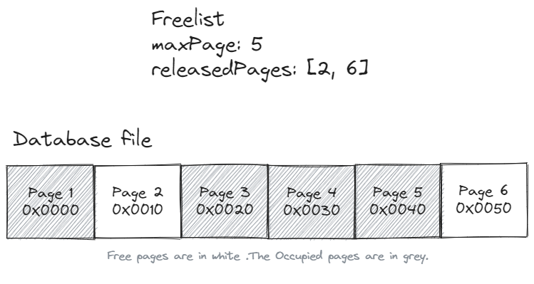

# JafarDB - A Decentralized NoSQL Database System

## Introduction
JafarDB is a decentralized NoSQL database system designed and implemented by Jafar Juneidi. This project aims to leverage the benefits of NoSQL databases in managing unstructured data within a distributed environment. The key innovation lies in the elimination of a central manager node, enhancing fault tolerance, load balancing, and data consistency.

## Modules and Components

### 1. JafarDB Implementation
#### 1.1 Storage Engine
- Implements a Key-Value based storage engine.
- Manages writing data to disk in pages (16KB page size).
- Utilizes B-Tree data structure for managing indexes.
- Supports ACID principles for transactions.
- Manages collections and ensures data consistency.

#### 1.2 Options
- Configuration entity for the storage engine.
- Allows customization of parameters like page size, fill percentages, etc.

#### 1.3 Freelist
- Manages and optimizes storage allocation within the database.
- Tracks allocated and released pages for efficient space utilization.

#### 1.4 Meta
- Serves as the metadata manager, holding essential information about the database's structure.
- Manages root collections, freelist pages, and ensures data integrity.

#### 1.5 Constants
- Utility component with predefined constant values and exception classes for consistency and error handling.

#### 1.6 DAL (Data Access Layer)
- Intermediary between high-level database operations and storage mechanisms.
- Manages file, meta, freelist, page, and node operations.

#### 1.7 Node
- Represents a fundamental building block of the B-Tree structure.
- Manages key-value pairs, child nodes, and provides methods for node operations.

#### 1.8 Collection
- Represents a collection of key-value pairs within the database.
- Manages B-Tree structure for data retrieval and manipulation.

#### 1.9 Transaction
- Represents a transactional context for database operations.
- Ensures atomicity, consistency, and isolation of operations.

#### 1.10 DB
- Main database object providing methods for opening, closing, and managing transactions.
- Implements a ReadWriteLock for concurrent access.

### 2. DB Frontend
- Interacts with the Storage Engine.
- Implements a multi-threaded Socket Server for receiving and forwarding requests.
- Uses the WireProtocol module for serialization and deserialization.

### 3. WireProtocol
- Implements a socket-based, request-response style protocol.
- Defines header and message structures for communication between clients and nodes.

### 4. Driver
- Helper module for clients (HTTP server or Shell program) to connect to the database.
- Responsible for connecting to a database node through a socket port.

### 5. Shell Program
- Represents the client for the database, offering a simple shell interface for user interaction.
- Communicates with the database using the Driver module.

### 6. Bootstrap
- Bootstrapping module running as a Socket Server on a known port.
- Uses Round-robin scheduling to maintain load-balanced nodes.

## Data Structures

### 1. B-Tree
- Self-balancing tree data structure for efficient insertion, deletion, and search operations.
- Ensures balanced height and efficient disk reads.
- Adaptability to changes in data.

### 2. Slotted Pages
- Storage method on disk for nodes with variable items.
- Divides pages into regions for keys/values and offsets to items.

## Multithreading and Locks
- Storage Engine: Implements a Reader-Writer lock for concurrent read and write transactions.
- DB Frontend: Uses a main thread for the Socket server and handles client connections with ClientHandler threads.

## Data Consistency
- Supports both Strong Consistency and Eventual Consistency based on use case requirements.

## Node Hashing and Load Balancing
- Bootstrap server responsible for load balancing new users among cluster nodes using Round-Robin scheduling.

## Communication Protocols Between Nodes
- WireProtocol: A socket-based protocol inspired by MongoDB's WireProtocol for communication between clients and database nodes.

## Security Issues
- Addresses potential security issues related to unauthorized access, data interception, corruption, insecure WireProtocol, and denial of service (DoS) attacks.

## Code Testing
- Thorough testing of the Storage Engine module with 32 tests covering major classes.
- Areas requiring further testing identified for future iterations.

## Code Quality
- Adherence to Clean Code principles, Effective Java items, SOLID principles, and integration of design patterns.

## DevOps Practices
- Version control using Git on GitHub.
- Containerization using Docker for consistent deployment and environment.

This project is an ongoing endeavor, with continuous improvement and refinement planned for future iterations.
